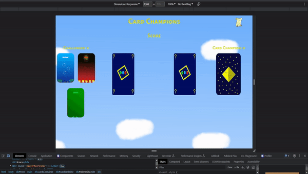

# Card Champions

Welcome challenger, you have been tasked with an almost impossible task: to defeat the Card Champion. Read the ancient papyrus to gain the secret knowledge essential to win, and may the random JavaScript algorithm be with you.

PLAY THE GAME: https://mrmaciejm.github.io/card-champions/

## Purpose Of This Project

I have created this project with few goals in mind:

- Put my newly learnt, and rather basic, digital drawing skills to use  
  (I accumulated over 20 hours of drawing practice, including this project)
- Expand my current skills by putting it all together (drawing, programming, designing, etc.)
- Avoid getting 'rusty' with React and coding while I am job hunting
- This project was laid out as a foundation for my bigger project that I plan to do in the future, after I sharpen my skills much more

## Bug Fixes and Updates

Tuesday 11th July 2023

- Fixed bug with the background not rendering properly when scaled to lower resolution
- Added table of contents to the App.jsx file for easier navigation
- Cleaned up and consolidated the CSS code, removed repeated code

## Future Development

There are a few things I want to add to this project in the future updates:

- Add 'Win' / 'Loss' after the player's turn
- Minor bug fixes
- Add gameplay mechanic (secret)
- Dynamic background theme
- Custom made battle music
- Volume controls for the music and sound effects
- Bonus development diary video, highlighting the process from start to finish  
   (including challenges faced, commentary and so forth)

## Game Video

## Screenshots

Screenshot of Card Champions - V1.0.0

## Copyright

© 2023 Maciej Matulewicz. All rights reserved.

This code and its accompanying assets are the intellectual property of Maciej Matulewicz. Unauthorized use, reproduction, or distribution of this code or its assets without written permission from the owner is strictly prohibited.

For further information or if you wish to use an asset, send an email to maciej456@icloud.com
